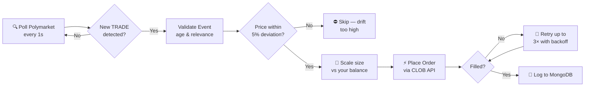

<div align="center">

# ⚡ Polymarket Copy Bot — Mirror Car in Real Time

[](https://nodejs.org)
[](https://mongodb.com)
[](https://polygon.technology)
[](LICENSE)
[]()

**Automatically mirror one of Polymarket's top-ranked traders — position for position, second by second.**

[View Target Wallet](https://polymarket.com/@Car?tab=activity) · [Report a Bug](https://github.com/LemnLabs/polymarket-trading-bot/issues)

</div>

---

## What This Does

**Car** is one of Polymarket's highest-performing prediction market traders. This bot watches their wallet 24/7 and **executes matching positions from your own wallet the moment they trade** — with capital-aware sizing, price drift protection, and automatic retry logic.

You don't predict markets. You mirror someone who does.

---

## Target Trader

| | Detail |
|---|---|
| **Handle** | [Car on Polymarket](https://polymarket.com/@Car?tab=activity) |
| **Wallet** | `0x7C3Db723F1D4d8cB9C550095203b686cB11E5C6B` |
| **Network** | Polygon (USDC) |
| **Strategy** | High-performance prediction market trading |

> **Why Car?** Consistently ranked among Polymarket's top traders with a track record of high-conviction, well-timed positions. Do your own research before mirroring any trader.

---

## How It Works



**Step by step:**

1. **Scan** — Polls Polymarket's CLOB API for fresh `TRADE` events from Car's wallet every second
2. **Validate** — Rejects events older than `TOO_OLD_TIMESTAMP` hours or unrelated activity
3. **Price check** — Compares current market mid-price against Car's fill price; skips if deviation exceeds `0.05`
4. **Size scaling** — Calculates your position size proportionally: `(your_balance / car_balance) × car_size`
5. **Execute** — Submits a limit order to Polymarket's CLOB with retry logic
6. **Record** — Persists all detections and executions to MongoDB for your own review

---

## Performance Expectations

> ⚠️ The table below describes **theoretical copy performance** based on publicly visible trades. Past activity does not guarantee future results. Your actual fills will vary due to slippage, latency, and market movement.

| Metric | Notes |
|---|---|
| **Copy latency** | ~1–3s from Car's fill to your order submission |
| **Price deviation limit** | Max `5%` drift before the bot skips the trade |
| **Position sizing** | Proportional to your balance vs Car's balance |
| **Retry attempts** | Up to `3×` with backoff on failed fills |
| **Data retention** | Full trade log in MongoDB |

*Add your own live PnL data here once you've run the bot.*

---

## Quick Start

### Prerequisites

- Node.js 18+
- MongoDB (local or [Atlas free tier](https://mongodb.com/atlas))
- Polygon wallet funded with USDC

### 1. Clone & Install

```bash
git clone https://github.com/LemnLabs/polymarket-trading-bot.git
cd polymarket-trading-bot
npm install
```

### 2. Configure

```bash
cp env.example .env
```

Open `.env` and fill in your values:

```env
# ── Target (do not change) ──────────────────────────────────────
USER_ADDRESS=0x7C3Db723F1D4d8cB9C550095203b686cB11E5C6B

# ── Your wallet ─────────────────────────────────────────────────
PROXY_WALLET=0xYourWalletAddress
PRIVATE_KEY=your_private_key_here          # never commit this

# ── Polymarket endpoints ─────────────────────────────────────────
CLOB_HTTP_URL=https://clob.polymarket.com
CLOB_WS_URL=wss://clob-ws.polymarket.com
RPC_URL=https://polygon-rpc.com
USDC_CONTRACT_ADDRESS=0x2791Bca1f2de4661ED88A30C99A7a9449Aa84174

# ── Storage ──────────────────────────────────────────────────────
MONGO_URI=mongodb://localhost:27017/polymarket_car

# ── Bot behavior ─────────────────────────────────────────────────
FETCH_INTERVAL=1          # seconds between polls
TOO_OLD_TIMESTAMP=24      # ignore trades older than N hours
RETRY_LIMIT=3             # order retry attempts
```

### 3. Build & Run

```bash
# Production
npm run build && npm start

# Development (hot reload)
npm run dev
```

✅ You should see the bot begin polling within seconds of starting.

---

## Configuration Reference

| Variable | Default | Description |
|---|---|---|
| `FETCH_INTERVAL` | `1` | Seconds between activity polls |
| `TOO_OLD_TIMESTAMP` | `24` | Max age of a trade event to act on (hours) |
| `RETRY_LIMIT` | `3` | Order submission retries before giving up |
| `USDC_CONTRACT_ADDRESS` | Polygon USDC | ERC-20 address for balance checks |

---

## ⚠️ Risk Disclosure

Read this before you run anything.

| Risk | Reality |
|---|---|
| **Slippage** | You will rarely get the same fill price as Car — sometimes significantly worse |
| **Latency** | By the time the bot detects and mirrors a trade, odds can already have shifted |
| **No guarantee of profit** | Even top traders have losing periods. Drawdowns happen. |
| **Infrastructure risk** | RPC outages, Polymarket API downtime, and MongoDB failures can all cause missed trades |
| **Smart contract risk** | Interacting with any on-chain protocol carries inherent risk |

**Start with a small amount you are comfortable losing entirely.** Monitor the first several trades manually before increasing size.

This software is provided as-is for research and educational purposes. The authors are not financial advisors. Nothing here constitutes financial advice.

---

## Contributing

PRs welcome — especially improvements to:

- Execution speed and CLOB order routing
- Price deviation algorithms
- Risk controls and position sizing models
- Observability (metrics, alerts, dashboards)

Please open an issue before large changes to discuss approach.

---

## License

ISC © [LemnLabs](https://github.com/LemnLabs)

---

<div align="center">

Built for prediction market traders who'd rather copy smart money than predict it themselves.

**[⭐ Star this repo](https://github.com/LemnLabs/polymarket-trading-bot)** if it saves you time.

</div>
